# diabetes_prediction
## 1. Installation
+ Tested on Python 3.7 (recommended to use a virtual environment such as Conda)
+ Install requirements: ```pip install -r requirement.txt```
+ EDA + Modeling + Training code: [notebooks/Diabetes_prediction.ipynb](notebooks/Diabetes_prediction.ipynb)
+ Data: [data/diabetes.csv](data/diabetes.csv)
+ Docker engine
+ Docker images: [dunghoang99/diabete-prediction-api:latest](https://hub.docker.com/repository/docker/dunghoang99/diabete-prediction-api/general), [dunghoang99/diabete-api-metrics:v1.0.0](https://hub.docker.com/repository/docker/dunghoang99/diabetes-api-metrics/general), [fullstackdatascience/jenkins:lts](https://hub.docker.com/r/fullstackdatascience/jenkins/tags) and [fullstackdatascience/jenkins-k8s/lts](https://hub.docker.com/r/fullstackdatascience/jenkins-k8s)
## 2. Fastapi
### FastAPI Service Architecture
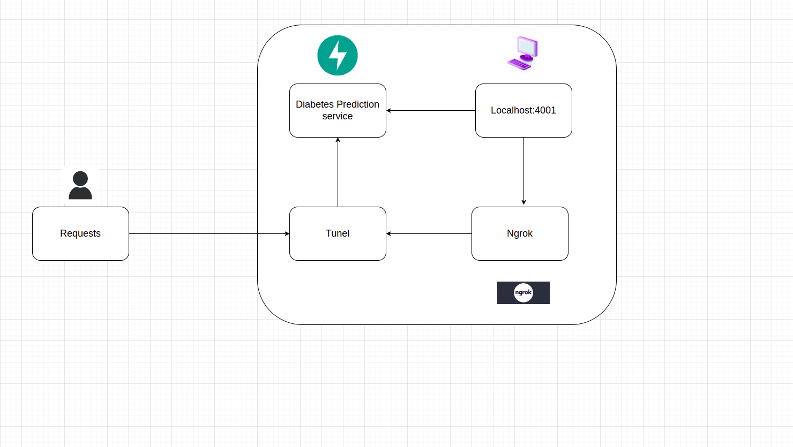
### How to guide
+ ```uvicorn main:app --host 0.0.0.0 --port 4001 --reload``` or ```docker pull dunghoang99/diabete-prediction-api:latest | docker run -p 4001:4001 dunghoang99/diabete-prediction-api:latest```
+ ```ngrok http 4001```
+ After that, you can get this to address (in my case is https://6207-171-232-89-217.ngrok-free.app, this address will be generated random) to access the service
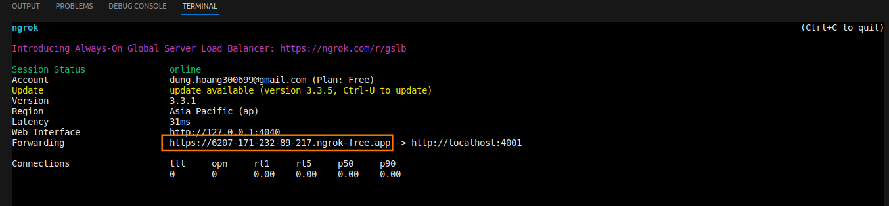
## 3. observable systems
When we have a service, we need some observable systems to monitoring our service. In this repo, we suggest Elastic Search, Grafana, Prometheus and Jaeger.
### Observable systems architecture
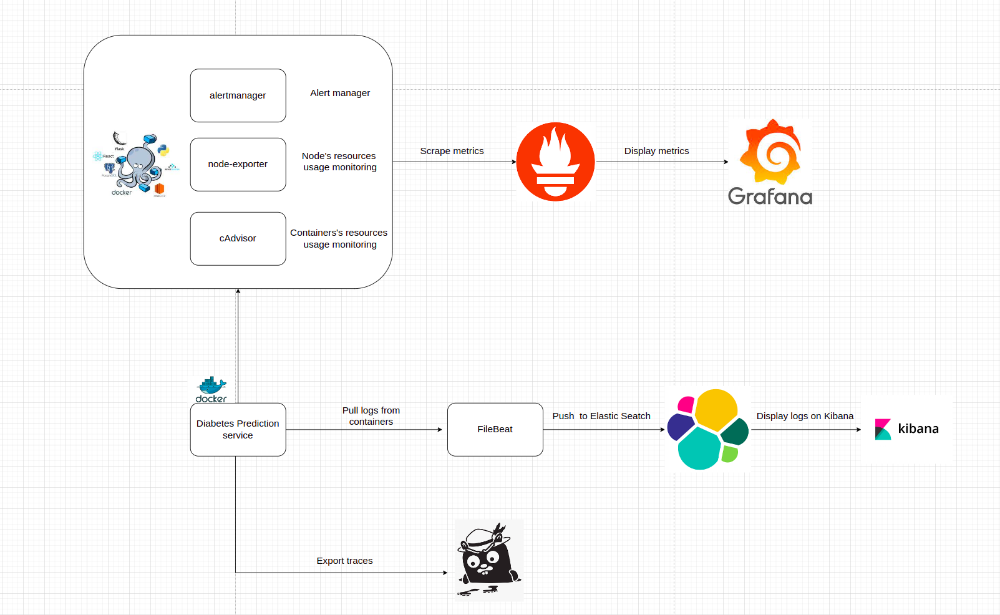
### 3.1 Elastic Search
#### How to guide
+ ```cd monitoring_docker/elk```
+ ```docker compose -f elk-docker-compose.yml -f extensions/filebeat/filebeat-compose.yml up -d```
+ You can access kibana at port 5601 to search logs, which FileBeat pulls logs from containers and pushes to ElasticSearch. Username and password of Kibana can be found at ```monitoring_docker/elk/.env```
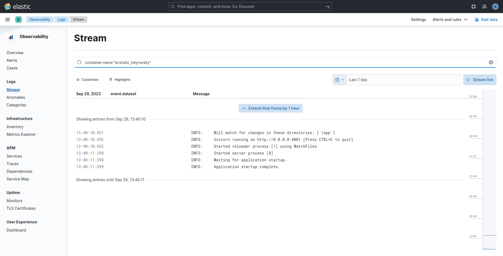
### 3.2 Prometheus + Grafana + Jaeger for monitoring resources and apps
#### How to guide
+ ```cd monitoring_docker```
+ ```docker compose -f prom-graf-docker-compose.yaml up -d```
+ ```python monitoring_docker/instrument/metrics/metrics.py```
+ ```python monitoring_docker/instrument/traces/trace_automatic.py```
+ Access to Prometheus, Grafana, Jaeger and enjoy!!!
+ Then, you can access Prometheus at port 9090, Grafana at 3001 and Jaeger at 16686. Username and password of Grafana is admin.
#### 3.2.1 Prometheus
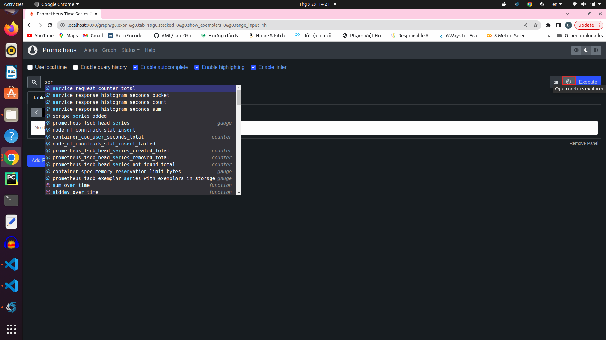
+ In Prometheus UI, you can search any metrics what you want to monitor and click on the button that i highlighted border to list all metrics prometheus scraping
#### 3.2.2 Grafana
When you access to Grafana, you can create your own dashboard to monitoring or use a template on Grafana Labs
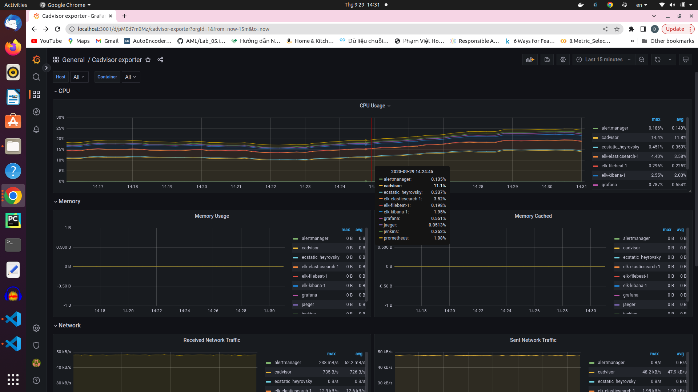
This is a dashboard for cadvisor that i pull from Grafana Labs, you can monitoring **CPU Usage** of each container as well as **Memory Usage**, **Memory cached**, etc ... All information was queried from Prometheus.

Besides, you can monitor node's resource usage and application on your own as i did below.

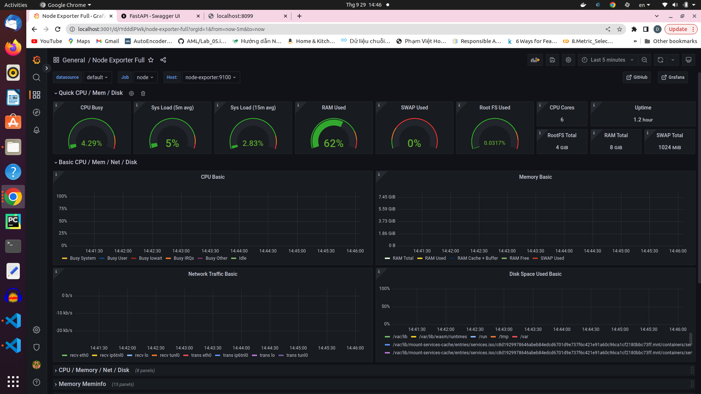
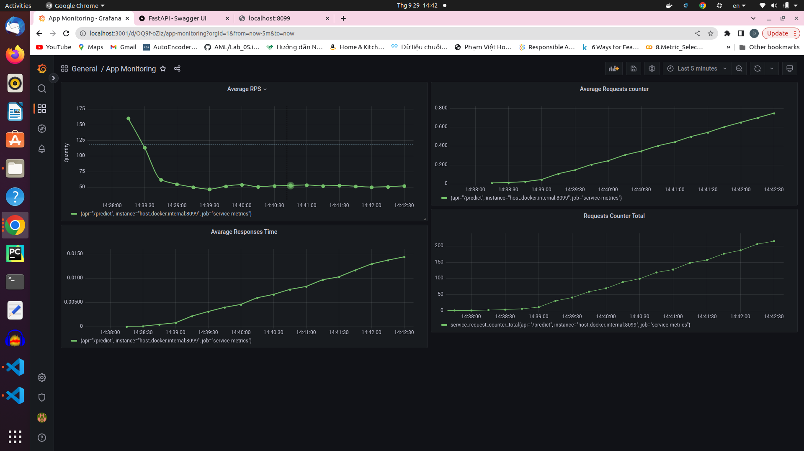
Throughout monitoring resources, you can set alerting rule for Alert-Manager to warning whenever resources usage is exceed some predefined alerting rule.
Alerting rule and webhook you can define in ```alertmanager/config.yml```. In my repo, whenever avalable memory of node is smaller than 5% and cpu usage of jenkins container is greater than 2%, Alert-Manager will send warning to my discord.
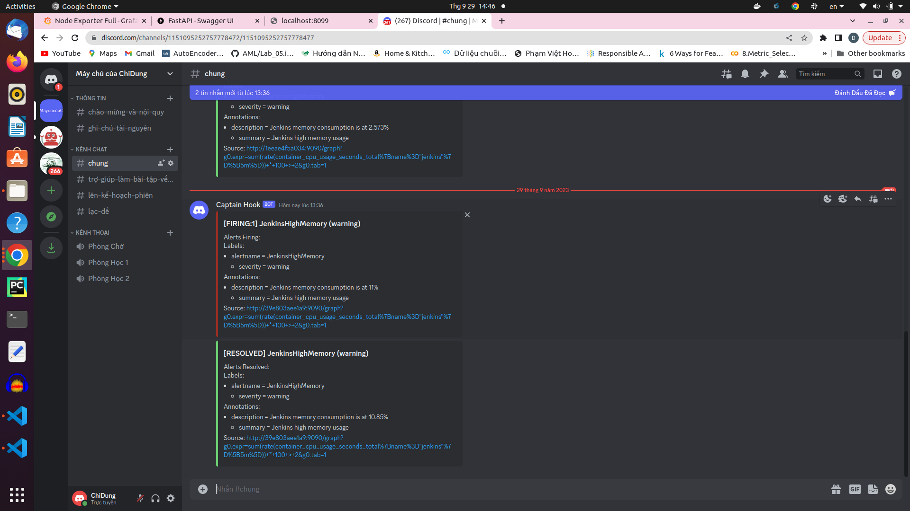
#### 3.3.3 Jaeger
Last but not least, sometimes you need to trace some block code processing time, Jaeger will help you do that.
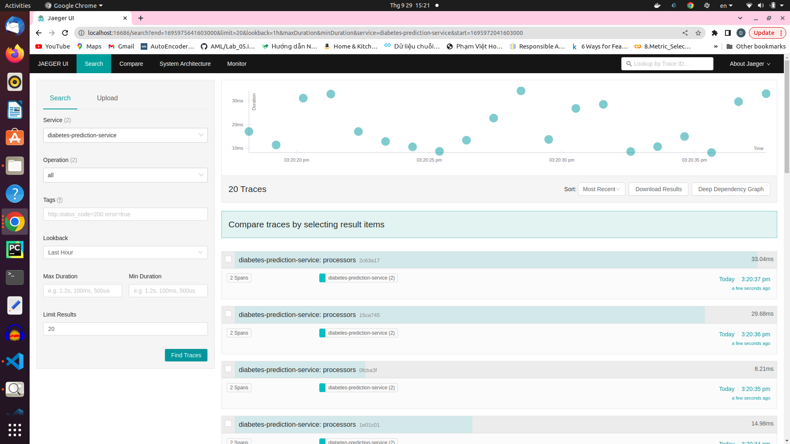
In Jaeger UI, all block code that you want to trace time will be displayed on right hand sides.
### 4 Jenkins
#### How to guide

+ ```docker compose -f jenkins_docker/docker-compose.yml up -d```

+ Jenkins service was exposed at port 8081, we can access by this port

+ Connect to github repo using ngrok. if 200 OK, you have already connect jenkins to github. 
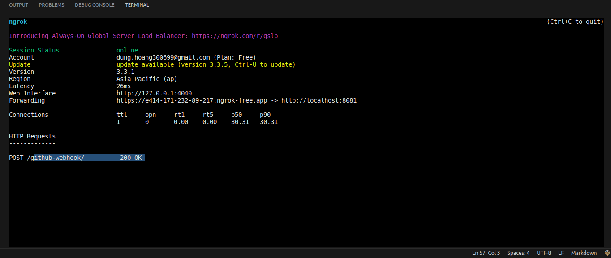

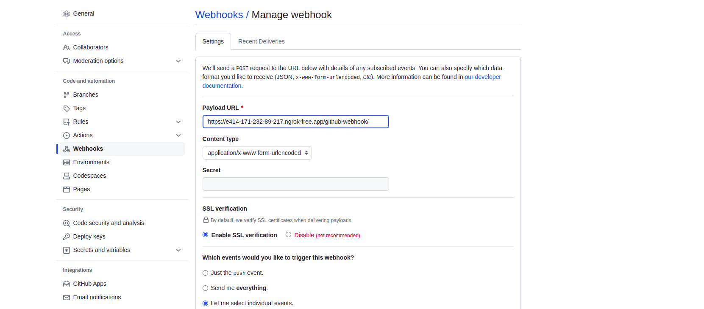

Additionally, in **Let me select individual events** in **Setting/Webhooks/Manage webhook**, tick **Pull requests** and **Pushes** to inform jenkins start to run whenever we push or pull code from github.

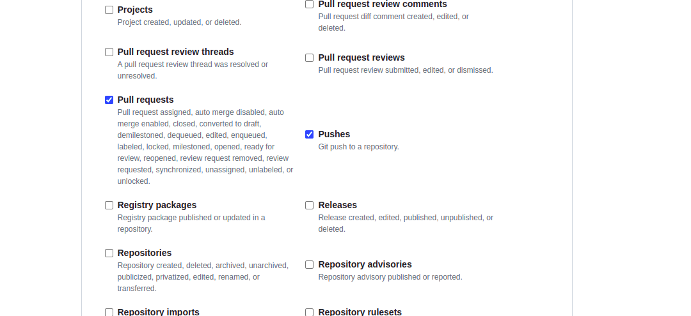

+ Access to Jenkins, click **New Item** to create new **Multibranch Pipeline**

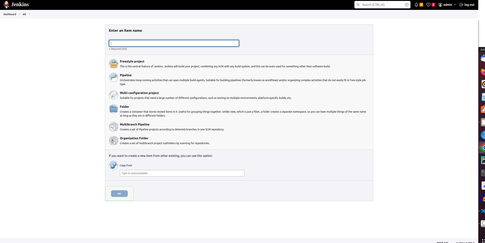

+ In **Configuration/Branch Sources**, choose **GitHub** in **Add source**

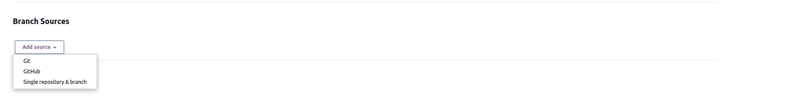

+ Then click **Add**, choose multibranch pipeline has created to configure github account

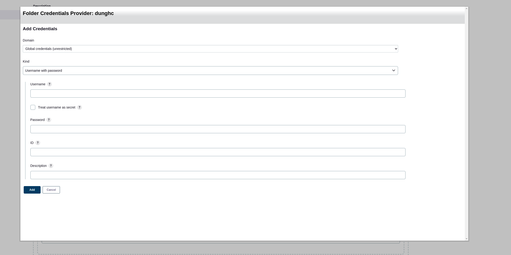

+ After that, in **Credentials**, click **global** in **Stores scoped**, then click **Add Credentials** to add Docker Hub account. 

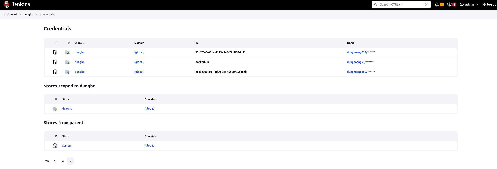

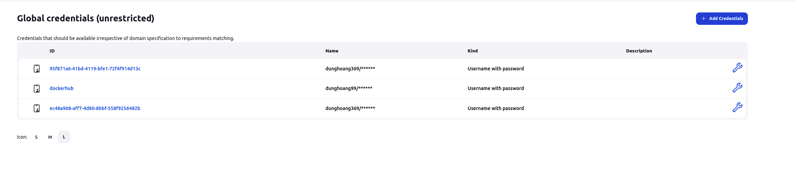

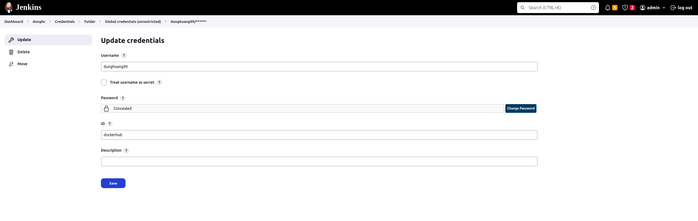

Username is username of docker hub and password that we set in docker hub.

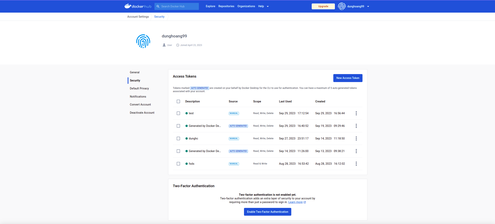

+ Whenever code is push to github or pull from github, Jenkins will take care all of this

+ Enjoy achivement!!!

## 5. K8s
### 5.1 GKE + Jenkins
### 5.2 GKE + Monitoring services
